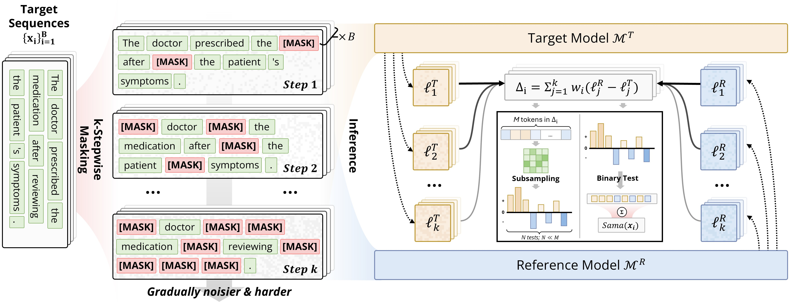

# Membership Inference Attacks on Finetuned Diffusion Language Models

[](https://arxiv.org/abs/2601.20125)
[](https://www.python.org/downloads/)

This repository contains the implementation of SAMA (Subset-Aggregated Membership Attack) and baseline methods for evaluating membership inference vulnerabilities in Diffusion Language Models (DLMs).

<p align="center">
  <a href="res/pipe.jpg">
    
  </a>
  <br>
  <em>
    Overview of SAMA
  </em>
</p>

## Repository Structure

```
.
├── trainer/         # DLM training module
│   ├── model/       # Model architectures
│   ├── configs/     # Training configurations
│   └── train.py     # Main training script
├── attack/          # MIA implementation module  
│   ├── attacks/     # Attack implementations (SAMA, baselines)
│   ├── configs/     # Attack configurations
│   └── run.py       # Main attack script
└── dataset/         # Dataset preparation utilities
```

## Requirements

### Environment Setup
```bash
# Create conda environment
conda create -n sama python=3.8
conda activate sama

# Install dependencies
pip install -r trainer/requirements.txt
pip install -r attack/requirements.txt
```

## Usage

### Step 0: Configure Environment Variables

Before running any experiments, set the following environment variables to match your platform. You can export them in your shell, add them to your `~/.bashrc`/`~/.zshrc`, or place them in a `.env` file and source it.

```bash
# Base directory where prepared datasets are stored.
export SAMA_DATASET_PATH="/path/to/your/datasets"

# Directory to save SAMA attack metadata (step-level scores, subset details).
export SAMA_METADATA_DIR="/path/to/metadata/output"

# Weights & Biases project and group names for training run tracking.
export SAMA_WANDB_PROJECT="Diff_LLM"
export SAMA_WANDB_GROUP="SAMA"

# HuggingFace token for accessing gated/private models.
export HF_TOKEN="hf_..."
```

The table below summarizes every environment variable, where it is read, and its default if unset:

| Variable | File(s) | Default |
|---|---|---|
| `SAMA_DATASET_PATH` | `trainer/configs/prep.py`, `dataset/prep.py`, `dataset/prep_mimir.py` | `./` |
| `SAMA_METADATA_DIR` | `attack/attacks/sama.py` | `./` |
| `SAMA_WANDB_PROJECT` | `trainer/configs/prep.py` | `Diff_LLM` |
| `SAMA_WANDB_GROUP` | `trainer/configs/prep.py` | `SAMA` |
| `HF_TOKEN` | `attack/attacks/sama.py`, `attack/attacks/ratio.py` | empty |

### Step 1: Prepare Datasets

Both scripts default their output directory to `$SAMA_DATASET_PATH` (set in Step 0).

```bash
# Download and prepare MIMIR benchmark datasets
python dataset/prep_mimir.py

# Prepare standard NLP datasets (wikitext, ag_news, xsum)
python dataset/prep.py
```

You can override the output directory or other defaults per-run:

```bash
# Custom output directory and sample count
python dataset/prep.py --output-dir /tmp/data --num-samples 5000

# Prepare only specific MIMIR subsets
python dataset/prep_mimir.py --datasets arxiv pile_cc --split-name ngram_13_0.8
```

Run `python dataset/prep.py --help` or `python dataset/prep_mimir.py --help` for all options.

### Step 2: Train Target DLM Models

See `trainer/README.md` for further details.

### Step 3: Run Membership Inference Attacks

```bash
python python -m attack.run \
    -c attack/configs/config_all.yaml \
    --output ./attack_results \
    --base-dir /path/to/your/trained/models
```

Key arguments for `attack.run`:

| Argument | Description |
|---|---|
| `-c, --config` | Path to attack configuration YAML (required) |
| `--output` | Directory to save results and metadata (required) |
| `--base-dir` | Base directory for resolving relative model/dataset paths in config (default: `./`) |
| `--target-model` | Path to target model, overrides config if provided |
| `--lora-path` | Path to LoRA adapter, overrides config if provided |
| `--seed` | Random seed (default: `42`) |

## Attack Configurations

Edit `attack/configs/config_all.yaml` or create your own attack configurations:

```yaml
sama:
  steps: 16              # Progressive masking steps
  min_mask_frac: 0.05    # Starting mask fraction  
  max_mask_frac: 0.50    # Ending mask fraction
  num_subsets: 128       # Subsets per step
  subset_size: 10        # Tokens per subset
  batch_size: 8          # Batch size
  
loss:
 module: loss
 mc_num: 4

loss-calibration:
  module: "ratio"
  reference_model_path: "GSAI-ML/LLaDA-8B-Base"
  reference_device: "cuda"

...
```


## Cite our work
```
@article{chen2026membership,
  title={Membership Inference Attacks Against Fine-tuned Diffusion Language Models},
  author={Chen, Yuetian and Zhang, Kaiyuan and Du, Yuntao and Stoppa, Edoardo and Fleming, Charles and Kundu, Ashish and Ribeiro, Bruno and Li, Ninghui},
  journal={arXiv preprint arXiv:2601.20125},
  year={2026}
}
```
